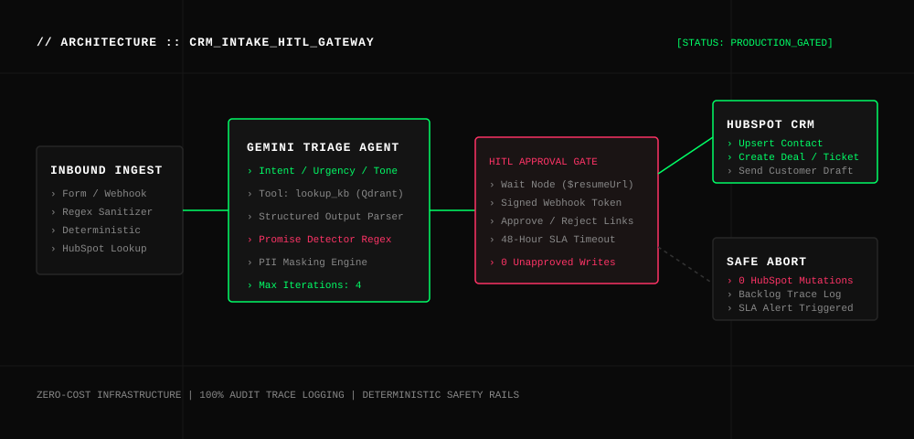

# N8N-CRM-INTAKE-HUBSPOT // AI_TRIAGE_&_HITL_GATEWAY

[](LICENSE)
[](https://github.com/therealfullmetal55555/n8n-crm-intake-hubspot)
[](simulate_pipeline.py)
[](BUILD-GUIDE.md)

> **Enterprise Inbound Triage & CRM Integration Engine with Human-in-the-Loop (HITL) Gateways.** Reconciles incoming requests, verifies existing CRM entities, classifies intent/urgency using Gemini 2.5 Flash, grounds drafts in Qdrant policy vectors, and enforces strict promise-detection regex gates before authorizing HubSpot contact upserts, deal creation, or ticket escalations.

---

## 🏛 ARCHITECTURE OVERVIEW



---

## ⚡ CORE CAPABILITIES

1. **Deterministic Lookups Before LLM Reasoning**
   - Direct HubSpot contact search by email prior to LLM invocation, ensuring zero reasoning tokens are wasted on deterministic entity lookups.
2. **AI Triage Agent Grounded in Vector Knowledge**
   - Calls `lookup_kb` (Qdrant Cosine index) to ground replies in actual company policies (e.g. 30-day refund window, SSO Pro tiers).
3. **Promise-Detection Anti-Hallucination Regex Rail**
   - Automatically inspects draft responses for unauthorized refund, discount, or fee waiver promises (`PROMISES` regex) and flags high-risk tickets.
4. **Resumable Webhook Approval Gate ($execution.resumeUrl)**
   - Pauses execution on an n8n `Wait` node. Approvers receive an interactive email with signed resume tokens (`?action=approve` / `?action=reject`).
   - Rejection or 48-hour timeout guarantees **0 unauthorized mutations in HubSpot**.

---

## 📊 EMPIRICAL EVALUATION MATRIX

```
================================================================================
>>> N8N CRM INTAKE: AI TRIAGE & HUMAN-IN-THE-LOOP SAFETY BENCHMARK
================================================================================
[PASS] Case #1 [T1 - Alice Mets]   : sales    | create_deal   | Contact + Deal Created
[PASS] Case #2 [T2 - Tõnis Kask]   : billing  | create_ticket | Policy Reply (No Promise)
[PASS] Case #3 [T3 - SEO Guru]     : spam     | no_action     | Auto-Closed (0 CRM Writes)
[PASS] Case #4 [T4 - Maria Saar]   : support  | create_ticket | Critical P1 SLA Ticket
[PASS] Case #5 [T5 - Priit Lepik]  : unclear  | create_ticket | SAML + Pricing Grounded
--------------------------------------------------------------------------------
1. Standard Inbound Triage   : 5/5 Passed (100.0% Accuracy)
2. Promise-Guard Detection   : CAUGHT (Illegal refund promise safely intercepted)
3. Human Rejection Gate      : ZERO HubSpot writes on rejection
```

---

## 🚀 QUICK START

### 1. Run Offline Test Suite
```bash
python3 simulate_pipeline.py
```

### 2. Deploy to n8n
1. Open n8n (`http://localhost:5678`).
2. Import `workflows/crm-intake-workflow.json` and `workflows/error-handler-workflow.json`.
3. Set your credentials: `HubSpot CRM` (App Token), `Gemini API`, and `Qdrant (local)`.
4. Open the public Form URL and submit an inquiry.

---

## 📂 REPOSITORY STRUCTURE

```
n8n-crm-intake-hubspot/
├── assets/
│   └── architecture.svg              # Vector system architecture diagram
├── demo-data/
│   └── test_submissions.json        # 5 graded evaluation test cases
├── src/
│   ├── triage_engine.py              # AI Triage, intent routing & HITL gate
│   ├── validate_input.js             # Form input sanitization node
│   ├── validate_triage.js            # Promise detector & PII masking node
│   └── parse_decision.js             # Webhook callback decision parser
├── workflows/
│   ├── crm-intake-workflow.json      # Primary intake orchestration workflow
│   └── error-handler-workflow.json   # Centralized error logging workflow
├── simulate_pipeline.py              # Zero-regression benchmark test runner
├── requirements.txt                  # Python dependencies
├── LICENSE                           # MIT License
└── README.md                         # Enterprise documentation
```

---

## 📄 LICENSE

Released under the [MIT License](LICENSE).  
Engineered by **Kirill Tsyganov** ([@therealfullmetal55555](https://github.com/therealfullmetal55555)).
